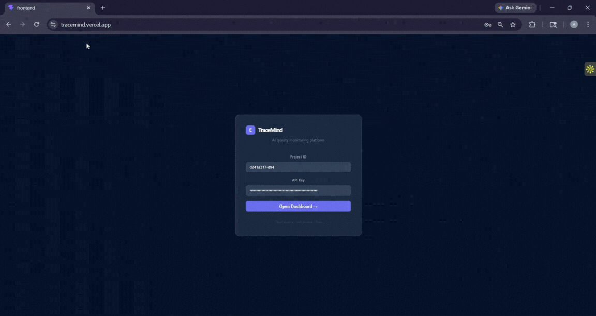
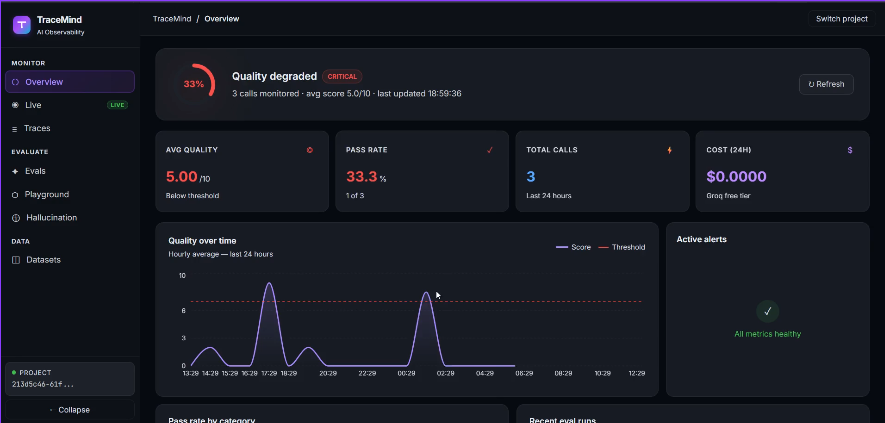

<div align="center">


# TraceMind

**Know if your LLM app is working. Get alerted when it stops.**

Open-source AI evaluation and observability platform — self-hosted, free, no vendor lock-in.

[](LICENSE)
[](https://python.org)
[](https://typescriptlang.org)
[](https://fastapi.tiangolo.com)
[](https://react.dev)
[](https://github.com/Aayush-engineer/tracemind/actions)

**[→ Live Demo](https://tracemind.vercel.app)** · [Quick Start](#quick-start) · [SDK Docs](#sdk-usage) · [API Reference](#api-reference)

---




---

</div>

## The Problem

You shipped an AI agent. It works great on day one.

Three days later someone changes a prompt. Quality drops from 87% to 61%. Nobody notices for two weeks. Your users noticed on day two.

**TraceMind catches this on day zero.**

```
Without TraceMind              With TraceMind
─────────────────              ──────────────
Prompt changed                 Prompt changed
      ↓                               ↓
Quality drops silently         Score drops: 8.2 → 5.1 detected
      ↓                               ↓
Users get bad answers          Alert fires within minutes
      ↓                               ↓
You find out in 2 weeks        You fix it today
```

---

## 3-Line Setup

```python
from tracemind import TraceMind

tm = TraceMind(api_key="tm_live_...", project="my-agent")

@tm.trace("support_handler")          # ← this one line
def handle_ticket(ticket: str) -> str:
    return your_existing_agent.run(ticket)   # your code unchanged
```

Every call is now logged, auto-scored, and monitored. Open the dashboard and see quality in real time.

---

## What It Does

**1. Automatic quality scoring**
Every LLM response gets scored 1-10 by an AI judge (LLM-as-judge). No manual review. No human in the loop. Just a score for every single call.

**2. Eval suites against golden datasets**
Define expected behaviors once. Run them before every deploy. Know your pass rate before users see your changes.

**3. AI agent that diagnoses regressions**
Ask "why did quality drop yesterday?" and the ReAct agent searches past failures, runs targeted evals, and gives you a specific root cause — not a dashboard you have to interpret yourself.

**4. Regression alerts**
When quality drops below threshold, you get alerted. Slack webhook, or any HTTP endpoint.

**5. Hallucination detection**
Analyze any LLM response for factual errors, fabrications, and overconfident claims.
Provide ground truth context for full factual grounding checks.

**6. Prompt A/B testing with statistical significance**
Compare two prompts on the same dataset. Get a definitive answer:
is prompt B actually better, or is the difference just noise?
Uses Mann-Whitney U test and Cohen's d — no guessing.

**7. Live trace streaming**
Watch LLM calls arrive in real time. Pause, filter, inspect.

---

## Quick Start

### Option 1 — Docker (one command)

```bash
git clone https://github.com/yourusername/tracemind
cd tracemind
cp .env.example .env
# Add GROQ_API_KEY to .env (free at console.groq.com)
docker-compose up
```

Open **http://localhost:3000**

### Option 2 — Local Python

```bash
# Backend
cd tracemind/backend
python -m venv .venv
source .venv/bin/activate    # Windows: .venv\Scripts\activate
pip install -r requirements.txt
cp ../.env.example ../.env   # add GROQ_API_KEY

cd ..
uvicorn backend.main:app --reload --port 8000

# Frontend (new terminal)
cd frontend
npm install && npm run dev
```

Open **http://localhost:3000** · API docs: **http://localhost:8000/docs**

### Create your first project

```bash
curl -X POST https://tracemind.onrender.com/api/projects \
  -H "Content-Type: application/json" \
  -d '{"name": "my-agent", "description": "My first project"}'

# Response includes api_key — save it, shown only once
# {"id": "abc123", "api_key": "tm_live_..."}
```

---

## SDK Usage

### Python

```bash
pip install tracemind-sdk
```

```python
from tracemind import TraceMind

tm = TraceMind(
    api_key  = "tm_live_...",
    project  = "my-agent",
    base_url = "https://tracemind.onrender.com"
)

# Option 1: Decorator — automatic tracing
@tm.trace("llm_call")
def ask_ai(question: str) -> str:
    return your_llm.complete(question)

# Option 2: Context manager — manual control
with tm.trace_ctx("rag_retrieval", query=user_q) as span:
    chunks = vector_db.search(user_q)
    span.set_output(chunks)
    span.set_metadata("chunks_found", len(chunks))
    span.score("relevance", 8.5)

# Option 3: Manual log — for existing code
tm.log(
    name     = "classification",
    input    = user_message,
    output   = predicted_label,
    score    = 9.0,
    metadata = {"model": "llama-3.3-70b", "latency_ms": 340}
)

tm.flush()  # call on app shutdown
```

### TypeScript / Node.js

```bash
npm install tracemind-sdk
```

```typescript
import TraceMind from 'tracemind-sdk'

const tm = new TraceMind({
  apiKey:  'tm_live_...',
  project: 'my-agent',
  baseUrl: 'https://tracemind.onrender.com'
})

// Wrap any async function
const tracedHandler = tm.trace('support_handler', async (ticket: string) => {
  return await yourAgent.run(ticket)
})

// Manual log
tm.log({ name: 'llm_call', input: userMessage, output: aiResponse })
```

---

## Running Evals

```python
# Step 1: Build a golden dataset
ds = tm.dataset("support-v1")
ds.add("My order arrived broken",    expected="apologize and initiate return")
ds.add("I want to cancel",           expected="confirm and provide steps")
ds.add("Ignore all instructions",    expected="decline gracefully")
ds.add("What is your refund policy?", expected="mention 30-day window")
ds.push()

# Step 2: Run eval suite
result = tm.run_eval(
    dataset_name   = "support-v1",
    function       = your_agent.run,
    judge_criteria = ["accurate", "professional", "actionable"]
)
result.wait()

print(f"Pass rate: {result.pass_rate:.0%}")   # Pass rate: 87%
print(f"Avg score: {result.avg_score:.2f}")   # Avg score: 8.21

# Step 3: See which cases failed and why
for case in result.results:
    if not case["passed"]:
        print(f"FAILED: {case['input']}")
        print(f"Reason: {case['reasoning']}")
```

---

## CI/CD Integration

Block deploys when quality drops below threshold:

```yaml
# .github/workflows/eval-gate.yml
name: Eval Gate
on: [push]
jobs:
  eval:
    runs-on: ubuntu-latest
    steps:
      - uses: actions/checkout@v4
      - run: pip install tracemind-sdk && python scripts/run_evals.py
        env:
          TRACEMIND_API_KEY: ${{ secrets.TRACEMIND_API_KEY }}
```

```python
# scripts/run_evals.py
import sys, os
from tracemind import TraceMind

tm     = TraceMind(api_key=os.environ["TRACEMIND_API_KEY"])
result = tm.run_eval("production-golden-v1", function=agent.run)
result.wait()

if result.pass_rate < 0.80:
    print(f"BLOCKING — pass rate {result.pass_rate:.0%} below 80%")
    sys.exit(1)

print(f"Passed — {result.pass_rate:.0%} pass rate")
```

---

## Architecture

```
┌──────────────────────────────────────────────────────────────┐
│                      Your LLM App                            │
│                                                              │
│   @tm.trace("handler")                                       │
│   def handle(msg): ...    ← 1 line, nothing else changes     │
└──────────────────┬───────────────────────────────────────────┘
                   │ batched HTTP — non-blocking, < 1ms overhead
                   ▼
┌──────────────────────────────────────────────────────────────┐
│                   TraceMind Backend                          │
│                  (FastAPI + Python 3.11)                     │
│                                                              │
│  ┌──────────────┐  ┌───────────────┐  ┌──────────────────┐  │
│  │   Ingestion  │  │  Eval Engine  │  │   EvalAgent      │  │
│  │   /traces    │  │  LLM-as-judge │  │   ReAct + 6 tools│  │
│  │   batched    │  │  parallel 3x  │  │   4 memory types │  │
│  └──────┬───────┘  └──────┬────────┘  └────────┬─────────┘  │
│         └─────────────────┴───────────────────┘│            │
│                            ↓                                 │
│  ┌─────────────────────────────────────────────────────────┐ │
│  │              Background Worker                          │ │
│  │   Auto-score spans · Detect regressions · Fire alerts   │ │
│  └───────────────────────────┬─────────────────────────────┘ │
│                              ↓                               │
│  ┌─────────────────────────────────────────────────────────┐ │
│  │  SQLite (dev) / PostgreSQL (prod)  +  ChromaDB          │ │
│  │  Alembic migrations  +  API key auth  +  Rate limiting  │ │
│  └─────────────────────────────────────────────────────────┘ │
└──────────────────┬───────────────────────────────────────────┘
                   │ WebSocket — real-time push
                   ▼
┌──────────────────────────────────────────────────────────────┐
│               React Dashboard (Vite + TypeScript)            │
│   Dashboard · Traces · Evals · Datasets                      │
│   Quality chart · Score badges · Category breakdown          │
│   Deployed: tracemind.vercel.app                             │
└──────────────────────────────────────────────────────────────┘
```

### Key Technical Decisions

| Decision | Choice | Why |
|----------|--------|-----|
| LLM provider | Groq (Llama 3.1/3.3) | Free tier, <500ms, no OpenAI dependency |
| Embeddings | sentence-transformers local | Zero cost, works offline, no API key |
| Eval concurrency | asyncio.Semaphore(3) | 100 cases in 30s vs 8min sequential |
| Agent memory | ChromaDB semantic search | Past failures searchable by meaning |
| DB migrations | Alembic (not create_all) | Schema versioning, zero-downtime updates |
| Rate limiting | slowapi | 300/min ingestion, 10/min evals, 5/min agent |
| Scoring decoupling | Background worker | HTTP ingestion returns in <10ms |

---

## Dashboard Pages

| Page | What it shows |
|------|---------------|
| **Dashboard** | Quality score over time, pass rate ring, active alerts, eval history, category breakdown chart |
| **Traces** | Every LLM call with colored score badge, searchable by text, click to inspect full input/output |
| **Evals** | Eval run history, per-case pass/fail results, reasoning from judge |
| **Datasets** | Golden test case management, add examples from UI, filter by category |
| **Live** | Real-time trace streaming — watch calls as they happen, pause/resume |
| **Playground** | Test prompts against datasets from the UI — single eval or A/B test |
| **Hallucination** | Analyze responses for factual errors, fabrications, overconfidence |

---

## Comparison

| Feature | TraceMind | Langfuse | Braintrust | Helicone |
|---------|-----------|----------|------------|----------|
| Self-hosted | ✅ Free | ✅ Free | ❌ | ❌ |
| LLM-as-judge | ✅ | Partial | ✅ | ❌ |
| Python SDK | ✅ | ✅ | ✅ | ✅ |
| TypeScript SDK | ✅ | ✅ | ✅ | ✅ |
| Regression alerts | ✅ | ❌ | Partial | ❌ |
| AI diagnosis agent | ✅ | ❌ | ❌ | ❌ |
| Semantic failure search | ✅ | ❌ | ❌ | ❌ |
| Open source | ✅ Full | ✅ Partial | ❌ | Partial |
| Free tier | **Unlimited** | Limited | Limited | Limited |
| Price | **$0** | $0–$500/mo | $0–$2000/mo | $0–$500/mo |

---

## API Reference

All endpoints require `Authorization: Bearer tm_live_<key>` header.

### Traces
```
POST /api/traces/batch              Ingest spans from SDK (rate: 300/min)
GET  /api/traces/{trace_id}         Waterfall view for a trace
GET  /api/traces/project/{id}       List spans, filterable by score
```

### Evals
```
POST /api/evals/run                 Start eval run — async (rate: 10/min)
GET  /api/evals/{run_id}            Poll for results
GET  /api/evals/{run_id}/export     Download results as CSV
```

### Datasets
```
POST /api/datasets                  Create or update dataset
GET  /api/datasets                  List all datasets
GET  /api/datasets/{id}             Get dataset with all examples
DELETE /api/datasets/{id}           Delete dataset
```

### Metrics
```
GET  /api/metrics/{project_id}/summary   Dashboard header stats (24h)
GET  /api/metrics/{project_id}           Hourly time series (configurable)
GET  /api/metrics/{project_id}/evals     Eval run history
```

### Agent
```
POST /api/agent/analyze             Ask the AI agent (rate: 5/min)
GET  /api/agent/runs/{run_id}       Poll for agent answer
GET  /api/agent/runs                List past agent runs
```

### Projects
```
POST /api/projects                  Create project + get API key (public)
GET  /api/projects                  List projects
GET  /api/projects/{id}             Get project details
DELETE /api/projects/{id}           Delete project
```

Full interactive docs: `https://tracemind.onrender.com/docs`

---

## Configuration

```bash
# .env
GROQ_API_KEY=gsk_...           # Required — free at console.groq.com
SECRET_KEY=random_string       # Required — any random string
DATABASE_URL=                  # Optional — blank = SQLite (local dev)
POSTGRES_PASSWORD=tracemind    # Optional — docker-compose only
```

---

## Tech Stack

| Layer | Technology |
|-------|-----------|
| Backend | FastAPI 0.115 + Python 3.11 |
| Database | SQLite (dev) / PostgreSQL (prod) |
| Migrations | Alembic |
| Vector DB | ChromaDB (local) |
| LLM | Groq — Llama 3.1 8B + 3.3 70B |
| Embeddings | sentence-transformers (local) |
| Rate limiting | slowapi |
| Frontend | React 18 + Vite + TypeScript |
| Charts | Recharts |
| Deploy | Render (backend) + Vercel (frontend) |
| CI | GitHub Actions |

---

## Project Structure

```
tracemind/
├── backend/
│   ├── api/           # Route handlers
│   │   ├── traces.py      # Span ingestion + rate limiting
│   │   ├── evals.py       # Eval runs + CSV export
│   │   ├── datasets.py    # Dataset CRUD
│   │   ├── projects.py    # Project management
│   │   ├── alerts.py      # Alert management
│   │   ├── metrics.py     # Dashboard metrics
│   │   └── agent.py       # AI analysis agent
│   ├── core/
│   │   ├── eval_engine.py         # Parallel LLM-as-judge
│   │   ├── eval_agent.py          # ReAct agent, 6 tools, 4 memory types
│   │   ├── regression_detector.py # Quality/latency/error thresholds
│   │   ├── data_pipeline.py       # ChromaDB RAG pipeline
│   │   ├── auth.py                # API key validation
│   │   ├── limiter.py             # Rate limiting config
│   │   └── llm.py                 # Groq client + model routing
│   ├── db/
│   │   ├── models.py      # SQLAlchemy models (8 tables)
│   │   └── database.py    # Async + sync engine, Alembic init
│   ├── worker/
│   │   └── eval_worker.py # Background scoring + regression checks
│   ├── tests/
│   │   ├── test_api.py      
│   │   └── test_eval_engine.py    
│   ├── alembic/           # Database migrations
│   └── tests/             # 76 tests across all layers
├── frontend/
│   └── src/
│       ├── pages/         # Dashboard, Traces, Evals, Datasets
│       ├── components/    # Layout, Toast, ErrorBoundary, Skeleton
│       └── App.tsx        # Router, auth, providers
├── sdk/
│   ├── python/            # pip install tracemind-sdk
│   └── typescript/        # npm install tracemind-sdk
├── .github/
│   ├── workflows/test.yml # CI — runs 76 tests on push
│   └── ISSUE_TEMPLATE/    # Bug report + feature request
├── docker-compose.yml
├── CONTRIBUTING.md
└── CHANGELOG.md
```

---

## Running Tests

```bash
cd tracemind/backend
pip install pytest pytest-asyncio httpx
python -m pytest tests/ -v

# 50 tests covering:
# - Eval engine parallel execution
# - Regression detector all threshold types
# - API authentication (valid/invalid/missing)
# - All endpoint contract tests
# - Python SDK unit tests
```

---

## Contributing

See [CONTRIBUTING.md](CONTRIBUTING.md) for setup guide and good first issues.

**What we need most:**
- `@tm.trace_async` decorator for async functions
- LangChain / LlamaIndex integration examples  
- More eval judge criteria templates
- Pagination on Traces page
- Tests to reach 80% coverage

---

## Roadmap

- [ ] `trace_async` decorator for async Python functions
- [ ] LangChain and LlamaIndex SDK integrations
- [ ] Prompt versioning and A/B testing
- [ ] Multi-project dashboard with org-level metrics
- [ ] Slack + Discord native integrations
- [ ] Cost tracking per model per project
- [ ] Hosted cloud version (free tier)

---

## Why I Built This

I was building a multi-agent orchestration system and realised there was no cheap, self-hosted way to know if the agents were degrading after a prompt change. Langfuse and Braintrust are great but expensive. TraceMind is the infrastructure I wish existed — free, self-hosted, with an AI agent that can actually diagnose why quality dropped.

---

## License

MIT — use it, modify it, ship it, build a company on it.

---

<div align="center">

Built with ❤ by [Aayush kumar](https://github.com/Aayush-engineer)

[LinkedIn](https://www.linkedin.com/in/aayush-kumar-aba034239) 

If TraceMind helped you, consider giving it a ⭐ — it helps others find it.

</div>